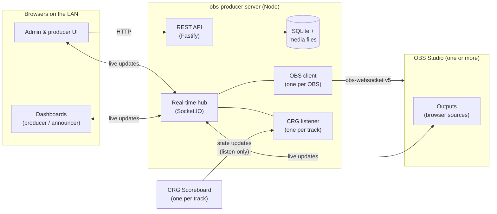

# Architecture overview

How OBS Producer fits together. This page describes the **intended** architecture, set out in the [ADRs](../decisions/README.md). Once code exists, update this page to match the code, and record any change of direction in a new ADR.

## System at a glance

Everything runs on the venue network and nothing needs the internet ([ADR-0004](../decisions/0004-server-is-the-hub.md)).

## Pieces

These workspaces are planned in [ADR-0012](../decisions/0012-typescript-7-and-oxlint.md).

| Workspace | Responsibility |
|---|---|
| `apps/server` | REST API, Socket.IO hub, authentication and role checks, SQLite, media storage, one connection per OBS and CRG instance, automation engine, live state |
| `apps/web` | React SPA for builders, Live Mode and dashboards. A separate lightweight **overlay entry** renders outputs for OBS |
| `packages/shared` | Zod schemas and TypeScript types used by both server and web: API, socket messages, import/export formats |

## How data flows

**Setup time.** The admin UI reads and writes teams, themes and screens through the REST API. In the browser, that data lives in the RTK Query cache ([ADR-0003](../decisions/0003-client-state-with-redux-toolkit.md)).

**Live.** The server is the single authority for live state ([ADR-0004](../decisions/0004-server-is-the-hub.md)).

1. When CRG pushes a state update to the server's listener for that track:
   1. The listener diffs the update against the previous state and detects game events ([CRG integration](integrations/crg-scoreboard.md#detecting-game-events)).
   2. The server evaluates [automation](../features/crg-automation.md) rules and updates live state.
   3. The server broadcasts the change to the right Socket.IO rooms: per track, per output, per dashboard.
2. When a producer acts on a dashboard:
   1. A socket event goes to the server.
   2. The server checks the producer's role ([ADR-0008](../decisions/0008-auth-rbac-and-overlay-access.md)).
   3. The server updates live state or sends an OBS request.
   4. The server broadcasts the result.
3. Outputs, dashboard previews and the builder canvas all render with the same presentational overlay components, so every view matches what's on air ([ADR-0006](../decisions/0006-one-overlay-renderer-css-variable-theming.md)).
4. When an output reloads, whether OBS restarted it or it was hidden and shown again, it rebuilds its entire state from the server.

**Socket.IO namespaces.** `/overlay` is public, so OBS outputs need no login until output token URLs arrive ([ADR-0008](../decisions/0008-auth-rbac-and-overlay-access.md)). The default namespace `/` is for signed-in clients such as dashboards. The server checks the session cookie when a client connects.

## Key decisions

Summaries only. The ADRs are canonical.

- [ADR-0003](../decisions/0003-client-state-with-redux-toolkit.md): Redux Toolkit; server data only in RTK Query.
- [ADR-0004](../decisions/0004-server-is-the-hub.md): The server owns live state and all external connections, and the app works offline.
- [ADR-0005](../decisions/0005-crg-is-listen-only.md): CRG is listen-only, and there are no score displays.
- [ADR-0006](../decisions/0006-one-overlay-renderer-css-variable-theming.md): One overlay renderer; themes as CSS custom properties.
- [ADR-0007](../decisions/0007-shared-zod-contract.md): Shared Zod contract; versioned import/export.
- [ADR-0008](../decisions/0008-auth-rbac-and-overlay-access.md): Server-side sessions and RBAC; a public overlay until output token URLs arrive.

## More

- [Data model](data-model.md): domain entities and how they relate
- [CRG scoreboard integration](integrations/crg-scoreboard.md)
- [OBS WebSocket integration](integrations/obs-websocket.md)
