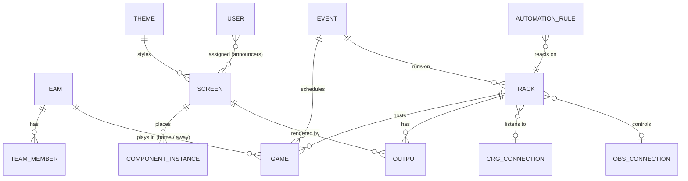

# Data model

This page covers the domain entities and how they relate. It deliberately lists no columns. The Drizzle schema in [`apps/server/src/db/schema.ts`](../../apps/server/src/db/schema.ts) is the source of truth for tables and fields, with migrations in `apps/server/drizzle/`. This page stays a map of the concepts.

## Entities

| Entity | Meaning | Feature page |
|---|---|---|
| Team | A team with its identity and members | [Team Builder](../features/team-builder.md) |
| Team member | A skater or a member of bench staff, with number, roles and photo | [Team Builder](../features/team-builder.md) |
| Theme | A named set of visual tokens | [Theme Builder](../features/theme-builder.md) |
| Screen | An overlay canvas: size, theme, placed components | [Screen Builder](../features/screen-builder.md) |
| Component instance | One overlay component placed on a screen, with position, size and options | [Overlay components](../features/overlay-components.md) |
| Event | A day of derby with one or more games and tracks | [Live Mode](../features/live-mode.md) |
| Track | A physical track that runs its own games concurrently | [Live Mode](../features/live-mode.md) |
| Game | Two teams playing on a track at a scheduled time | [Live Mode](../features/live-mode.md) |
| Output | One screen rendered for one track at a tokenized URL, added to OBS | [Live Mode](../features/live-mode.md) |
| CRG connection | Address of a CRG instance to listen to | [CRG automation](../features/crg-automation.md) |
| OBS connection | Address and credentials of an OBS instance | [OBS control](../features/obs-control.md) |
| Automation rule | A CRG trigger plus an action on components or OBS | [CRG automation](../features/crg-automation.md) |
| User | An account with a role | [Users and access](../features/users-and-access.md) |

## Persisted vs live state

- **Persisted** (SQLite and media files): everything in the table above.
- **Live** (held in memory on the server and broadcast over Socket.IO):
  - the current game on each track;
  - component visibility and live selections, such as the skater in the spotlight;
  - the latest CRG state for each track;
  - OBS status.

  Live state rebuilds itself after a restart, from persisted data plus fresh CRG and OBS state. Whether any of it should also be saved is an open question.

## Open questions

- Should tracks belong to an event, or be set up once per venue and reused across events?
- Should an output be tied to a track (as drawn above), a game, or neither, following whatever game is current on its track?
- Do game rosters (a subset of a team for one game) need their own entity?
- Should any live state, such as the current game per track, persist across a server restart mid-event?
- Automation rules are drawn per track. Do they belong on screens or events instead? See [CRG automation](../features/crg-automation.md).
